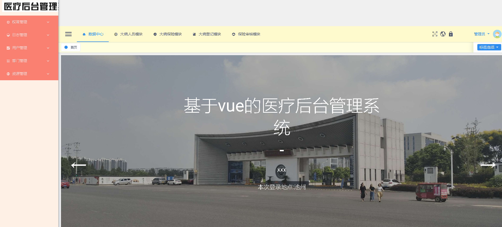
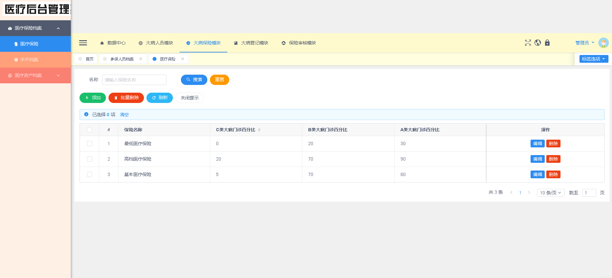
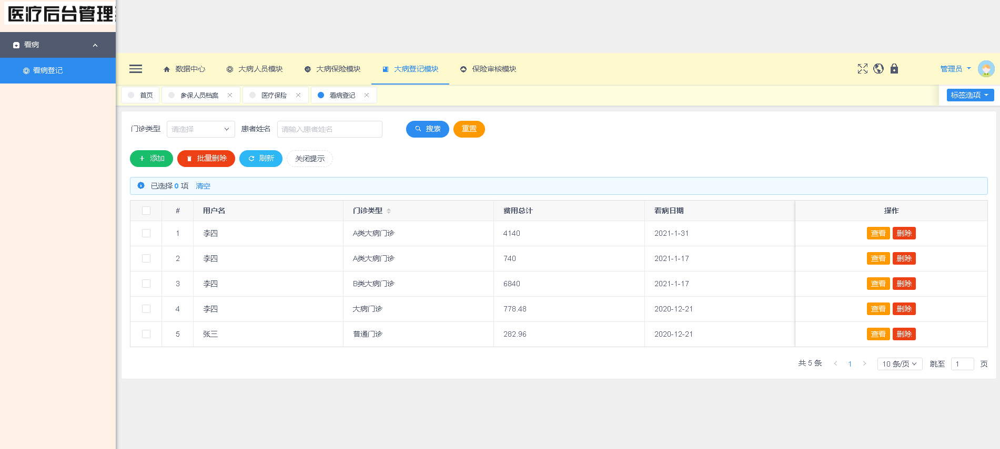
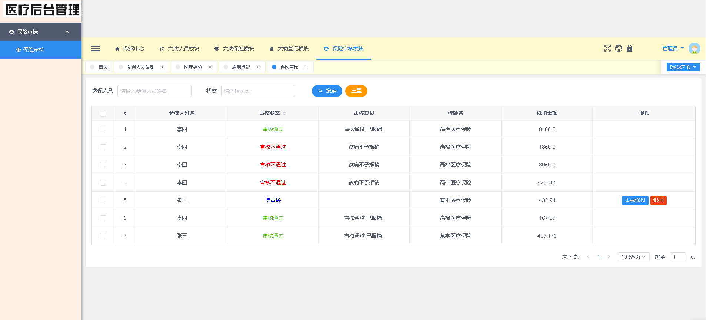

# medicineSystem-master

毕业设计：主题“基于Vue的医疗管理”
“基于Vue + SpringBoot + Redis + Mysql8的医疗管理”

项目完整代码已上传，包含必要代码备注。

数据库私聊获取：

email：xiehdwork@163.com

wx:15349843018

##### 项目部署+指导；论文指导；答辩一对一细节指导......

#### 项目部分截图：

1. 登录页：

2. 数据中心

3. 大病人员模块

4. 大病保险模块

5. 大病登记模块

6. 保险审核模块

